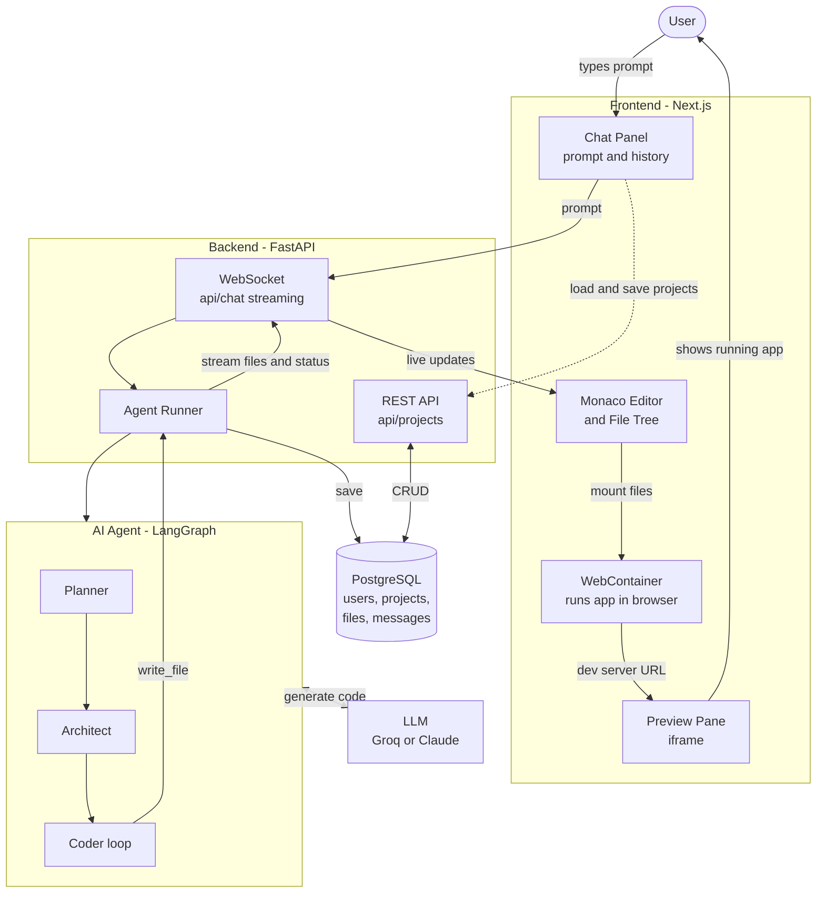

# Building a Lovable.dev Clone — Full Build Plan

> Goal: A web app where a user types a prompt → our AI agents generate a full
> working app → user sees a **live preview** running in the browser → user can
> keep chatting to edit it. Like [lovable.dev](https://lovable.dev),
> [bolt.new](https://bolt.new), and [v0.dev](https://v0.dev).

We already have the hard part started: a working **multi-agent code generator**
(`Planner → Architect → Coder`) in `agent/graph.py`. This plan turns that CLI
engine into a real product with a UI, backend, storage, and live preview.

---

## 1. The Core Idea — How Lovable-style Apps Work

The "magic" is 4 systems working together:

```
┌─────────────┐   prompt    ┌──────────────┐   files    ┌──────────────┐
│   Browser   │ ──────────► │   Backend    │ ─────────► │   AI Agent   │
│  (Chat UI + │             │  (API + WS)  │ ◄───────── │ (our graph)  │
│   Preview)  │ ◄────────── │              │   stream   └──────────────┘
└─────────────┘   stream    └──────────────┘
       │                           │
       │ runs generated app        │ saves files
       ▼                           ▼
┌─────────────┐             ┌──────────────┐
│ WebContainer│             │   Database   │
│ (live app   │             │  (projects,  │
│  in iframe) │             │   files)     │
└─────────────┘             └──────────────┘
```

The single most important design decision is **how to run the generated app for
preview**. There are two approaches:

| Approach | How | Pros | Cons |
|----------|-----|------|------|
| **WebContainers** (Lovable/bolt use this) | StackBlitz's tech runs a full Node.js runtime *inside the browser* via WebAssembly | No server cost, instant, secure (sandboxed in browser) | Node/JS apps only, learning curve |
| **Server sandboxes** | Run each app in a Docker container / [E2B](https://e2b.dev) / Firecracker VM on your server | Any language, full control | Expensive, complex, security-heavy |

**Recommendation: Use WebContainers for the MVP.** It's exactly what Lovable and
bolt.new use, costs nothing to run, and is secure by design. We can add
server sandboxes later for non-JS stacks.

---

## 2. Tech Stack

| Layer | Choice | Why |
|-------|--------|-----|
| **Frontend** | Next.js 15 (React) + TypeScript + Tailwind | Industry standard, great DX, easy deploy |
| **Code editor** | Monaco Editor (VS Code's editor) | Free, powerful, familiar |
| **Live preview** | `@webcontainer/api` (StackBlitz) | Runs generated app in-browser |
| **Backend API** | FastAPI (Python) | Keeps our existing LangGraph agent in Python — no rewrite |
| **Realtime** | WebSockets (streaming tokens + file updates) | Live "typing" feel like Lovable |
| **AI Agent** | Our existing LangGraph graph (extended) | Already built and working |
| **LLM** | Groq (current) → add Claude (Anthropic) for quality | Groq = fast/cheap, Claude = best code quality |
| **Database** | PostgreSQL + Prisma/SQLAlchemy | Store users, projects, files, chat history |
| **Auth** | Clerk or Supabase Auth | Don't build auth from scratch |
| **File storage** | Postgres (small) or S3/R2 (large projects) | Persist generated projects |
| **Job queue** | Redis + Celery (or just async tasks for MVP) | Generation runs in background |
| **Deploy** | Frontend → Vercel, Backend → Railway/Render | Simple, cheap to start |

**Key principle:** Keep our Python agent as-is. Wrap it in FastAPI. Build a
separate Next.js frontend. They talk over HTTP + WebSocket.

---

## 3. System Architecture (Detailed)

### 3.0 High-Level Design (Mermaid)



### 3.1 Components

```
                        ┌────────────────────────────────────────┐
                        │              FRONTEND (Next.js)         │
                        │                                         │
                        │  ┌─────────┐ ┌──────────┐ ┌──────────┐ │
                        │  │  Chat   │ │  Monaco  │ │ Preview  │ │
                        │  │  Panel  │ │  Editor  │ │ (iframe) │ │
                        │  └─────────┘ └──────────┘ └──────────┘ │
                        │       │           │            ▲       │
                        │       │           │      WebContainer  │
                        └───────┼───────────┼────────────────────┘
                                │ WS/HTTP   │
                                ▼           ▼
                        ┌────────────────────────────────────────┐
                        │            BACKEND (FastAPI)            │
                        │                                         │
                        │  /api/projects   /api/chat (WebSocket)  │
                        │       │                  │              │
                        │  ┌────▼─────┐    ┌───────▼──────────┐   │
                        │  │ Project  │    │  Agent Runner    │   │
                        │  │ Service  │    │ (LangGraph graph)│   │
                        │  └────┬─────┘    └───────┬──────────┘   │
                        └───────┼──────────────────┼──────────────┘
                                │                  │
                       ┌────────▼──────┐   ┌───────▼────────┐
                       │  PostgreSQL   │   │  LLM (Groq /   │
                       │ users/projects│   │   Claude)      │
                       │  files/chats  │   └────────────────┘
                       └───────────────┘
```

### 3.2 Database Schema (core tables)

```sql
users        (id, email, name, created_at)
projects     (id, user_id, name, description, created_at, updated_at)
files        (id, project_id, path, content, updated_at)
messages     (id, project_id, role, content, created_at)   -- chat history
generations  (id, project_id, status, tokens_used, created_at)  -- each run
```

### 3.3 The Agent — extended from what we have

Our current graph: `Planner → Architect → Coder (loop) → END`.

For a product we extend it to support **edits** (not just first-time generation):

```
                  ┌──────────────────────────────────────┐
   New project →  │ Planner → Architect → Coder → Preview │
                  └──────────────────────────────────────┘

                  ┌──────────────────────────────────────┐
   Edit request → │ Context Loader → Edit Planner → Coder │
                  │  (reads existing files)   → Preview   │
                  └──────────────────────────────────────┘
```

New agent capabilities needed:
- **Streaming**: emit tokens + file writes over WebSocket as they happen
- **Edit mode**: load existing project files as context, make targeted changes
- **Self-healing**: when preview shows an error, feed it back to the agent to fix
- **Tool: `write_file`** already exists — we route its output to DB + WebContainer

---

## 4. End-to-End Data Flow (the important part)

**Scenario: user types "build a todo app" then "make it dark mode"**

```
1.  User types prompt in Chat Panel, hits Enter
        ↓
2.  Frontend opens WebSocket → POST prompt to /api/chat
        ↓
3.  Backend saves message to DB, starts Agent Runner (background task)
        ↓
4.  PLANNER agent runs → emits Plan → streamed to UI ("Planning… 📋")
        ↓
5.  ARCHITECT agent runs → emits task list → streamed ("Designing files…")
        ↓
6.  CODER agent loops per file:
        - generates code
        - write_file() called
        - backend saves file to DB
        - backend pushes file over WebSocket → frontend
        ↓
7.  Frontend receives each file → updates Monaco editor + writes into WebContainer
        ↓
8.  WebContainer runs `npm install && npm run dev` → app boots
        ↓
9.  Preview iframe shows the LIVE running app 🎉
        ↓
10. User types "make it dark mode" → back to step 1 in EDIT mode
        - agent loads existing files as context
        - changes only what's needed
        - preview hot-reloads
```

The "live typing" feel = streaming file contents token-by-token over the WebSocket
and rendering them in Monaco as they arrive.

---

## 5. Phased Build Plan

Each phase is a working milestone. Don't skip ahead — each builds on the last.

### Phase 0 — Foundations (1 week)
**Goal: project skeleton, both apps run locally and talk to each other.**
- [ ] Restructure repo: `/backend` (our Python agent + FastAPI), `/frontend` (Next.js)
- [ ] FastAPI server with a `/health` endpoint
- [ ] Wrap existing `agent.invoke()` in a `/api/generate` POST endpoint (non-streaming first)
- [ ] Next.js app with a single page: textarea + "Generate" button → calls backend → dumps JSON result
- [ ] Fix the Windows UTF-8 / debug-logging issues for server use (turn off `set_debug`)

✅ **Done when:** you type a prompt in the browser, backend generates files, frontend shows the file list.

### Phase 1 — Persistence & Projects (1 week)
**Goal: save work, list projects, reopen them.**
- [ ] Add PostgreSQL + schema (users, projects, files, messages)
- [ ] `write_file` tool writes to DB instead of disk
- [ ] CRUD API: create project, list projects, get project files
- [ ] Frontend: projects dashboard + project workspace page
- [ ] Add auth (Clerk) — users only see their own projects

✅ **Done when:** generate an app, refresh the page, it's still there.

### Phase 2 — The Workspace UI (1–2 weeks)
**Goal: the real 3-panel Lovable layout.**
- [ ] Left: Chat panel (message history + input)
- [ ] Middle: Monaco editor + file tree
- [ ] Right: Preview area (placeholder for now)
- [ ] Wire file tree → click file → show in editor
- [ ] Polished, responsive layout with Tailwind

✅ **Done when:** it *looks* like Lovable, files are editable, chat shows history.

### Phase 3 — Live Preview (2 weeks) ⭐ hardest
**Goal: generated app actually runs in the browser.**
- [ ] Integrate `@webcontainer/api`
- [ ] On project load: mount all files into WebContainer
- [ ] Run `npm install` + dev server inside WebContainer
- [ ] Pipe WebContainer's dev server URL into the preview iframe
- [ ] Handle the agent generating proper `package.json` / Vite/Next setup so apps are runnable
- [ ] Switch agent's default stack to **React + Vite** (WebContainer-friendly)

✅ **Done when:** generate a todo app → it runs live in the preview pane.

### Phase 4 — Streaming & Real-time (1 week)
**Goal: the live "watching it build" experience.**
- [ ] Convert generation to WebSocket streaming
- [ ] Stream agent status ("Planning", "Writing index.html"…)
- [ ] Stream file contents into Monaco as they generate
- [ ] Auto-update WebContainer + hot reload preview on each file

✅ **Done when:** you watch files appear and the preview update live, like Lovable.

### Phase 5 — Edit Mode & Self-Healing (2 weeks)
**Goal: conversational editing — the real product loop.**
- [ ] Add EDIT path to the agent graph (loads existing files as context)
- [ ] Agent makes targeted edits, not full regeneration
- [ ] Capture preview/console errors → feed back to agent → auto-fix loop
- [ ] Chat remembers full conversation context per project

✅ **Done when:** "make the buttons blue" actually edits the existing app correctly.

### Phase 6 — Polish & Ship (ongoing)
- [ ] Upgrade LLM to Claude for code quality (keep Groq as fast/cheap option)
- [ ] Export project (download ZIP / push to GitHub)
- [ ] Deploy generated apps (one-click to Vercel/Netlify)
- [ ] Templates / starter prompts
- [ ] Token usage tracking + rate limits per user
- [ ] Billing (Stripe) if going commercial

---

## 6. Key Technical Challenges (know these upfront)

1. **Making generated apps runnable** — the agent must output a *complete, valid*
   project (package.json, correct imports, a working dev server). This is the #1
   thing that breaks. Solution: lock the agent to a known-good template (React +
   Vite) and give it strict prompt rules.

2. **WebContainer constraints** — only runs Node-based stacks, needs specific file
   structure, ~loads slowly first time. Budget real time for Phase 3.

3. **Streaming complexity** — coordinating agent → backend → WebSocket → editor →
   WebContainer without race conditions. Build it incrementally.

4. **Context window for edits** — large projects won't fit in one prompt. Later
   you'll need smart file selection (only send relevant files to the LLM).

5. **Cost & rate limits** — every keystroke-driven regeneration costs tokens.
   Cache, debounce, and use cheaper models (Groq) for simple edits.

---

## 7. MVP vs Full Product

**Minimum lovable MVP (Phases 0–4):** type a prompt → watch a React app build live
→ see it running in preview → save/reopen projects. ~6–8 weeks solo.

**Full product (add 5–6):** conversational editing, self-healing, export, deploy,
billing. ~3–4 months solo.

---

## 8. Recommended Starting Point

Start **Phase 0 today**: restructure into `/backend` + `/frontend`, wrap the
existing agent in FastAPI, get a button in Next.js to trigger it. Everything else
builds on that foundation. The AI brain already works — we're building the body
around it.
