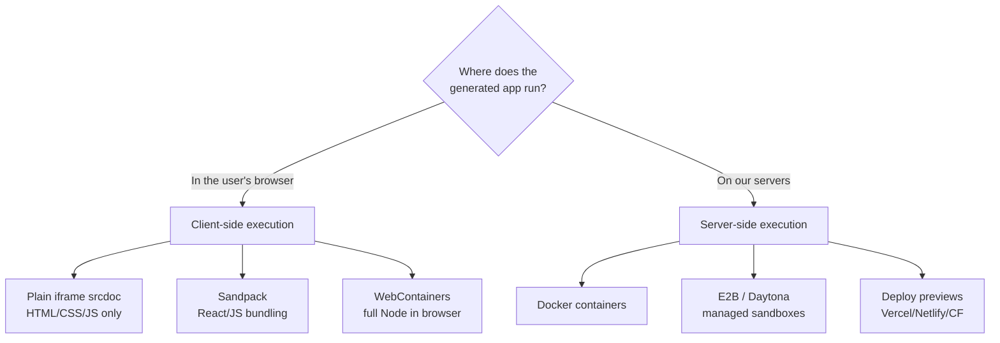
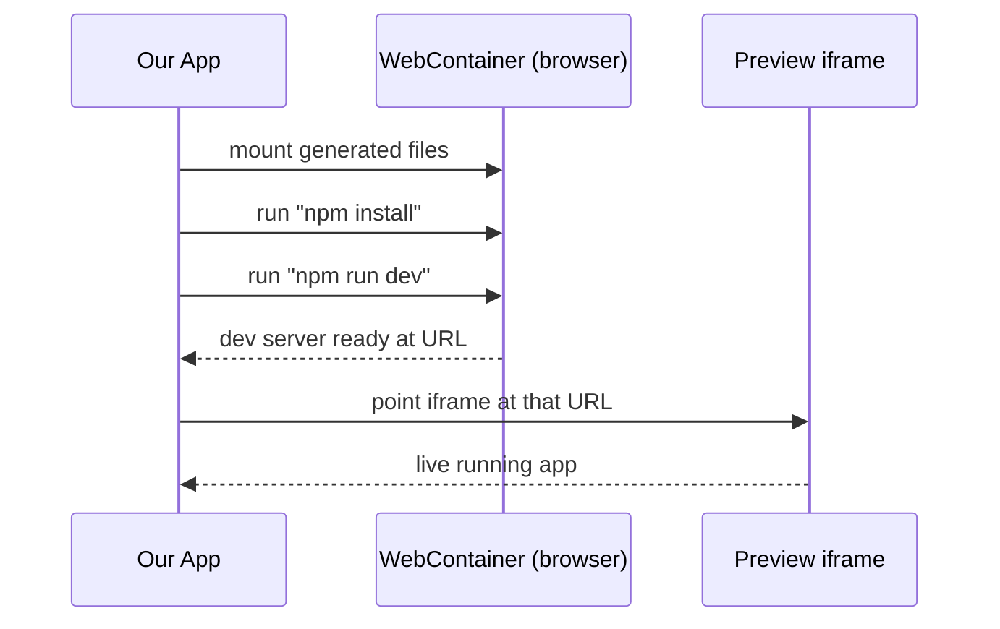
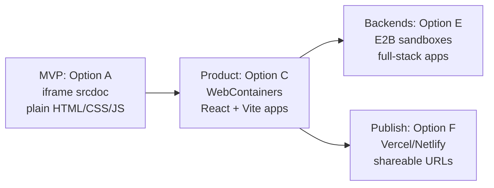
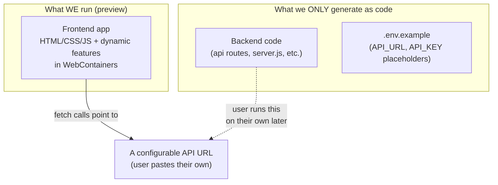

# Running & Previewing the Generated App — Options & Trade-offs

> The hardest, most important design decision in a Lovable-style builder:
> **where and how does the generated app actually run so the user can see it live?**
>
> This doc lays out every realistic option, how each works, and the trade-offs,
> so we can pick the right one (and a migration path).

---

## 1. The Core Problem

When the AI generates code, the user wants to **see it running immediately** —
not download a zip and run `npm install` themselves. So we need an execution
environment that:

1. Takes the generated files
2. Installs dependencies (if any)
3. Runs a dev server (or just renders static files)
4. Shows the result in an `iframe` inside our app
5. Hot-reloads when the AI edits the code

The big fork in the road: **run it in the user's browser** (client-side) or
**run it on our servers** (server-side).



---

## 2. Client-Side Options (run in the browser)

### Option A — Plain `iframe` with `srcdoc` (simplest possible)

**How:** For pure HTML/CSS/JS apps (exactly what our agent makes today), just
inject the generated files into an `iframe`. No server, no build step.

```js
const html = `<!DOCTYPE html><html><head><style>${css}</style></head>
  <body>${bodyHtml}<script>${js}<\/script></body></html>`;
iframe.srcdoc = html;   // instantly renders
```

| | |
|---|---|
| ✅ Pros | Zero infra, instant, free, dead simple, secure (sandbox attr) |
| ❌ Cons | **No npm packages**, no React/Vite, no real dev server, no multi-file imports |
| 💰 Cost | $0 |
| 🛠️ Effort | Very low (a day) |
| 🎯 Best for | MVP day-1 preview, since our agent already outputs plain HTML/CSS/JS |

> This is the fastest way to get *a* preview working. Great starting point even if
> we later move to WebContainers.

---

### Option B — Sandpack (by CodeSandbox)

**How:** A React component library that **bundles and runs JS/React apps in the
browser**. You hand it a set of files; it transpiles and renders them. Used by
many docs sites and tutorials.

| | |
|---|---|
| ✅ Pros | Easy to embed (`<Sandpack/>`), supports React/Vue/JS, handles npm deps (common ones), free |
| ❌ Cons | Bundles in-browser (not a real Node env), limited backend support, package support not 100% |
| 💰 Cost | Free (open source) |
| 🛠️ Effort | Low–medium |
| 🎯 Best for | Frontend-only React/JS apps without a backend |

---

### Option C — WebContainers (by StackBlitz) ⭐ what Lovable/bolt use

**How:** Runs a **full Node.js runtime inside the browser** via WebAssembly. It
has a real filesystem, can run `npm install`, start a Vite/Next dev server, and
serve the app — all client-side. The dev server URL is piped into our iframe.



| | |
|---|---|
| ✅ Pros | Real Node env, runs Vite/Next/Express, full npm, no server cost, secure (browser sandbox), instant hot reload |
| ❌ Cons | **Node/JS stacks only**, first boot is slow-ish, learning curve, needs specific cross-origin headers (COOP/COEP) |
| 💰 Cost | Free for personal/OSS; **commercial use needs a StackBlitz license** |
| 🛠️ Effort | Medium–high (Phase 3 of build plan) |
| 🎯 Best for | The real product — matches Lovable/bolt exactly |

> ⚠️ Licensing note: WebContainers are free for non-commercial use. If this becomes
> a paid product, you need a commercial agreement with StackBlitz. Factor this in.

---

## 3. Server-Side Options (run on our servers)

### Option D — Docker containers (self-hosted sandboxes)

**How:** Each generated app runs in its own Docker container on our backend. We
expose the container's port and proxy it into the preview iframe.

| | |
|---|---|
| ✅ Pros | **Any language/stack** (Python, Go, full backends, databases), full control |
| ❌ Cons | Expensive (a container per active user), complex orchestration, big security surface, slow cold starts |
| 💰 Cost | High (servers scale with active users) |
| 🛠️ Effort | High (k8s/orchestration, networking, security hardening) |
| 🎯 Best for | When you must support non-JS backends and have budget |

---

### Option E — Managed AI Sandboxes (E2B, Daytona, Modal)

**How:** Services purpose-built to run AI-generated code in isolated cloud
sandboxes via an API/SDK. [E2B](https://e2b.dev) is the popular one — spin up a
sandbox, run code, get output, tear down.

| | |
|---|---|
| ✅ Pros | Any stack, secure isolation, fast startup (built for this), simple SDK, no infra to manage |
| ❌ Cons | Per-second/usage billing, external dependency, still need to proxy preview |
| 💰 Cost | Medium (pay per sandbox-second) |
| 🛠️ Effort | Medium |
| 🎯 Best for | Server-side execution without building your own Docker fleet |

---

### Option F — Deploy Previews (Vercel / Netlify / Cloudflare Pages)

**How:** Instead of a live dev server, **deploy** the generated app to a host and
show the deployed URL. Each generation = a deploy.

| | |
|---|---|
| ✅ Pros | Real production-like preview, shareable public URL, scales automatically |
| ❌ Cons | Slower (deploy takes seconds–minutes), not instant hot reload, API rate limits, cost per deploy at scale |
| 💰 Cost | Low–medium (generous free tiers) |
| 🛠️ Effort | Medium |
| 🎯 Best for | The "Publish / Share" feature — give users a real live link |

---

## 4. Side-by-Side Comparison

| Option | Stacks | Live HMR | Infra cost | Effort | Security | Verdict |
|--------|--------|----------|-----------|--------|----------|---------|
| A. iframe srcdoc | HTML/CSS/JS | manual | $0 | ⭐ | High | **Start here** |
| B. Sandpack | JS/React FE | yes | $0 | ⭐⭐ | High | Good FE-only |
| C. WebContainers | Node/JS | yes | $0* | ⭐⭐⭐ | High | **Target** |
| D. Docker | Any | yes | $$$ | ⭐⭐⭐⭐ | Medium | Heavy |
| E. E2B/Daytona | Any | yes | $$ | ⭐⭐⭐ | High | Backend later |
| F. Deploy preview | Any | no | $ | ⭐⭐⭐ | High | For "Publish" |

\* WebContainers free for non-commercial; commercial needs a license.

---

## 5. Recommended Path (staged)



1. **Now / MVP:** **Option A (iframe srcdoc)**. Our agent already emits plain
   HTML/CSS/JS — we can show a live preview *this week* with almost no work.
2. **Product:** **Option C (WebContainers)**. Switch the agent to output React +
   Vite, run it in WebContainers for the true Lovable experience. (Mind the
   commercial license.)
3. **Full-stack later:** **Option E (E2B)** when users want real backends/databases.
4. **Sharing:** **Option F** for a "Publish" button that gives a public URL.

> Why this order: each step is independently shippable, and step 1 gets a working
> preview in front of users immediately while we build toward step 2.

---

## 6. ✅ FINAL DECISION (locked in)

Based on the requirements:

- **Not commercial** -> WebContainers is free to use, no license concern.
- **Preview shows the FRONTEND only** -> all HTML/CSS/JavaScript and dynamic
  features run live.
- **No real backend is ever run by us.** The AI still *generates* backend code
  (API routes, server files) plus a `.env.example`, but we deliver it as
  **files only** — the user runs it themselves later.

### What this means



**Decision: Use WebContainers (Option C) for the frontend preview, and generate
backend as code-only with an env example. No server-side execution (skip D & E).**

### How frontend "dynamic features" work in preview without a backend

The generated frontend will make API calls (`fetch`). Since there's no live
backend in preview, we handle it one of three ways (AI picks per project):

1. **Configurable API URL** — generate a `config.js` / `.env` with an
   `API_URL` the user can paste their own backend/endpoint into. Empty by
   default; preview still loads.
2. **Public APIs** — if the app uses a public API (weather, etc.), `fetch`
   works directly in the preview, fully dynamic.
3. **Mock mode** — generate a small mock-data layer (e.g. `mockApi.js` or
   `localStorage`) so the app is fully interactive in preview with fake data,
   and a clear comment showing where to swap in the real API.

This gives a **fully working, dynamic frontend preview** while keeping the
backend as portable code the user owns.

### Generated project shape (example)

```
my-app/
  frontend/            <- runs live in WebContainers preview
    index.html
    src/...
    config.js          <- API_URL the user can edit
  backend/             <- code only, NOT run by us
    server.js
    routes/...
  .env.example         <- API_KEY, DB_URL placeholders
  README.md            <- how to run the backend yourself
```

So WebContainers boots and serves `frontend/`, the user sees it working, and the
`backend/` + `.env.example` sit ready for them to run on their own machine/host.

---

## 7. Open Questions (for later)

- **Commercial intent?** If yes, the WebContainers license cost matters — Sandpack
  (Option B) is a license-free alternative for FE-only apps.
- **Do we need backends/databases in generated apps?** If yes soon -> plan for
  Option E early. If "frontend apps only" -> WebContainers is enough.
- **How important is an instant first preview?** If critical -> start with Option A
  even though we'll replace it.
- **Budget for infra?** $0 pushes us client-side (A/B/C). Budget unlocks D/E.
